# JMP-Tools
| [Description](#description) | [Current Tools](#current-tools) | [Tool Descriptions](#tool-descriptions) | [Todo](#generic-jmp-tools-todo) | [Disclaimer](#disclaimer-from-author)

## Description

### Purpose
Purpose of these tools is to provide additional functionalities to JMP and further enchance JMP. Some of the tools also include scripting techniques which might be interesting to some users and standalone functions which you can use in your own scripts.

### Repositories 
The repositories in [jthi-jmp-tools](https://github.com/jthi-jmp-tools) include addin for installing the tool and required files to rebuild build the Add-in. The addins currently built with [Add-In Manager by Justin Chilton](https://community.jmp.com/t5/JMP-Add-Ins/Add-In-Manager/ta-p/43736) because it provides superior user-experience when compared to native JMPs Add-in builder (even thou Add-In Manager is missing toolbars for example).

Most of the tools include README.md, README.html, settings.json, script files and the installation addin.

### Installation
It is easiest to install addins from [this repository's releases page](https://github.com/jthi-jmp-tools/JMP-Tools/releases). Addin's can also be installed from each tools own repository or this repository's [addins folder](https://github.com/jthi-jmp-tools/JMP-Tools/tree/main/addins). To install them from non-release page, open the addin file then click download on the right side.

Most of the tools will be added under JMP's Add-Ins menu in JMP-Tools but there are also exceptions, such as Order Selected Columns which will be added to Cols menu. 

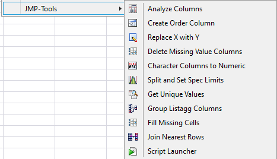

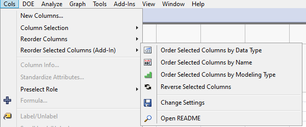

Because there is no installer to install all of the tools at the same time, multiple folders will be created to addins folder and View/Add-Ins menu.

Some of the tools also offer settings.json to change default behaviours. 

## Current Tools
List of current tools provided. By clicking the tool name you will be redirect to that tools description in this README and by clicking *Github link* you will be redirected to Github repo foir that tool which includes the addin for installation and better description of the tool.

1. [Analyse Columns](#1-analyse-columns-gui) ([GitHub link](https://github.com/jthi-jmp-tools/analyse-columns))
2. [Character Columns to Numeric](#2-character-columns-to-numeric-functions) ([GitHub link](https://github.com/jthi-jmp-tools/character-columns-to-numeric))
3. [Create Order Column](#3-create-order-column) ([GitHub link](https://github.com/jthi-jmp-tools/create-order-column))
4. [Delete Missing Value Columns](#3-create-order-column) ([GitHub link](https://github.com/jthi-jmp-tools/delete-missing-value-columns))
5. [Fill Missing Cells](#5-fill-missing-cells) ([GitHub link](https://github.com/jthi-jmp-tools/fill-missing-cells))
6. [Get Unique Values](#6-get-unique-values)([GitHub link](https://github.com/jthi-jmp-tools/get-unique-values))
7. [Group Listagg Columns](#7-group-listagg-columns) ([GitHub link](https://github.com/jthi-jmp-tools/group-listagg-columns))
8. [Join Nearest Columns](#8-join-nearest-rows) ([GitHub link](https://github.com/jthi-jmp-tools/join-nearest-rows))
9. [Order Selected Columns](#9-order-selected-columns) ([GitHub link](https://github.com/jthi-jmp-tools/order-selected-columns))
10. [Replace X with Y](#10-replace-x-with-y) ([GitHub link](https://github.com/jthi-jmp-tools/replace-x-with-y))
11. [Split and Set Spec Limits](#11-split-and-set-spec-limits) ([GitHub link](https://github.com/jthi-jmp-tools/split-and-set-spec-limits))
12. [Script Launcher](#12-script-launcher) ([GitHub link](https://github.com/jthi-jmp-tools/script-launcher))
13. [File Indexer](#13-file-indexer) ([GitHub link](https://github.com/jthi-jmp-tools/file-indexer))

## Tool descriptions

### 1. [Analyse Columns](https://github.com/jthi-jmp-tools/analyse-columns)
*Get quick overview of columns you select. Also provides some manipulations you can perform on selected columns on right click menu and buttons.*

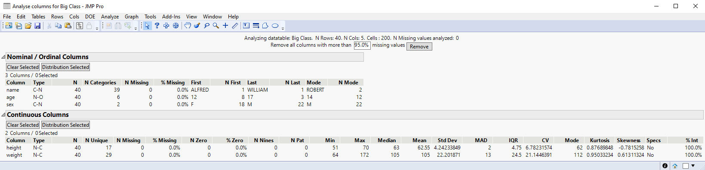

### 2. [Character Columns to Numeric](character_columns_to_numeric/)
*Change character columns to numeric if possible.*

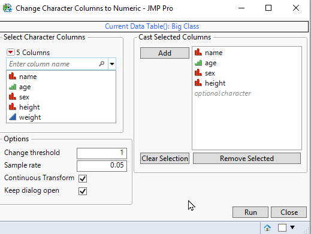

### 3. [Create Order Column](https://github.com/jthi-jmp-tools/create-order-column)
*Create ordering column to datatable

### 4. [Delete Missing Value Columns](https://github.com/jthi-jmp-tools/delete-missing-value-columns)
*Delete columns which have more than desired amount of missing values.*

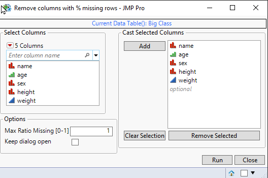

### 5. [Fill Missing Cells](https://github.com/jthi-jmp-tools/fill-missing-cells)
*Fill missing cells based on existing values. Doesn't require the data to be sorted, supports grouping and multiple options of fill directions.*

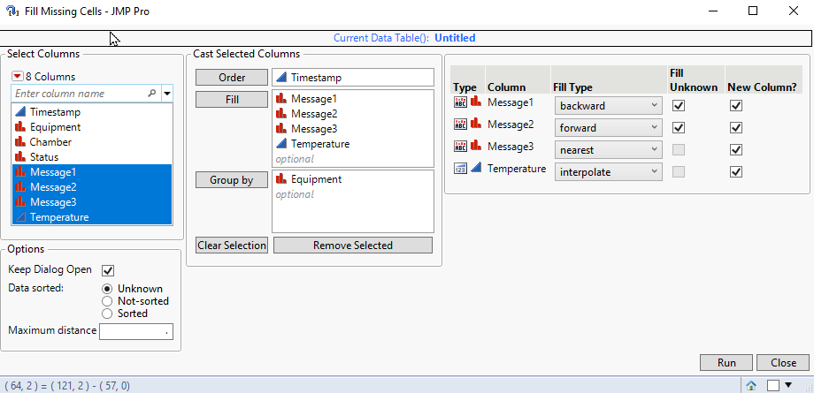

### 6. [Get Unique Values](https://github.com/jthi-jmp-tools/get-unique-values)
*Get unique values from columns and copy them to clipboard in different formats.*

### 7. [Group Listagg Columns](https://github.com/jthi-jmp-tools/group-listagg-columns)
*Group data in single (multiple expression) column. Most useful when combined with [Summary](https://community.jmp.com/t5/JMP-Wish-List/Add-Listagg-Concatenate-GROUP-CONCAT-to-Summary-platform/idi-p/441070) or [Split](https://community.jmp.com/t5/JMP-Wish-List/Allow-Split-to-create-Multiple-Response-columns/idi-p/440972) -table platforms.*

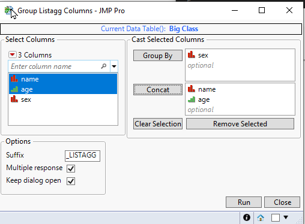

### 8. [Join Nearest Rows](https://github.com/jthi-jmp-tools/join-nearest-rows)
*Join two tables based on continuous columns, for example timestamp. Doesn't require data to be sorted, allows grouping columns and offers multiple join directions.*

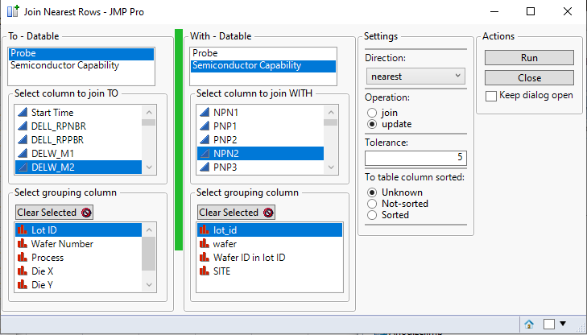

### 9. [Order Selected Columns](https://github.com/jthi-jmp-tools/order-selected-columns)
*Provides extensions to JMP's existing column ordering options which work for selected colums*.

### 10. [Replace x with Y](https://github.com/jthi-jmp-tools/replace-x-with-y)
*Quickly replace value **x** with value **y** in multiple columns.*

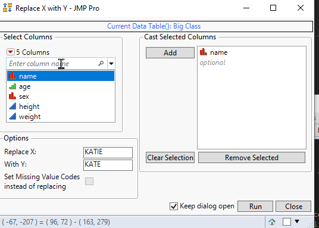

### 11. [Split and Set Spec Limits](https://github.com/jthi-jmp-tools/split-and-set-spec-limits)
*Format tall datatatable with measurement data and specification limits into wide table with specification limit column properties*

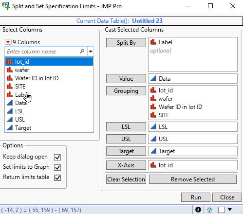

### 12. [Script Launcher](https://github.com/jthi-jmp-tools/script-launcher)
*Provides user interface to launch JMP Scripts. Also allows opening README.html and changing settings.json if such exist in desired location.*

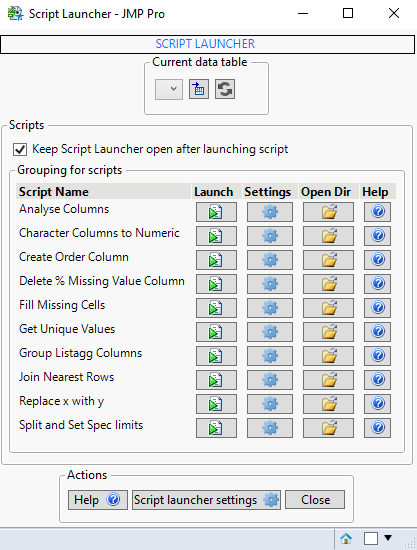

### 13. [File Indexer](https://github.com/jthi-jmp-tools/file-indexer)
*Provides folder structure of specified directories and allows opening directories/files.*

**This tool is still totally unfinished**

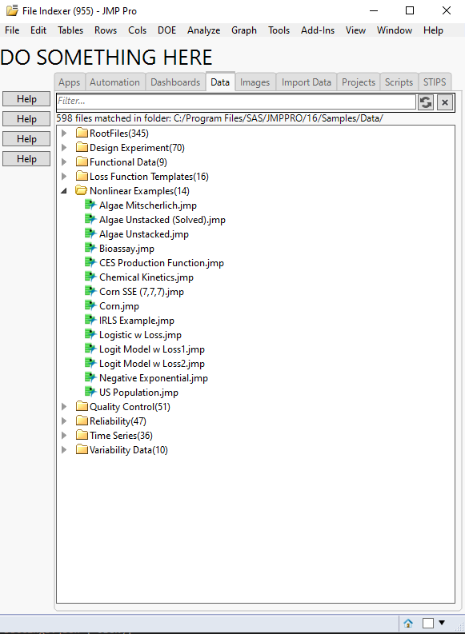

## Generic JMP-Tools todo
 * Add help buttons to scripts
   * In best case this would open README.md files and parse them 
   * Could also maybe load markdown page from github / create help wiki there and use that?
 * Create "custom" settings files / gui
   * Add possibility to creator to add limits to values
   * Could have generic settings.jsl for example -> on first run it could create settings file if not existing
 * Modify load_settings() functions in such a way, that it won't just replace default values, but rather inserts them. And if settings.json has missing keys, defaults will be saved there
 * Add general ideas of these tools to this README.md
   * functions and gui separated
   * .md file / .html file
   * naturaldocs compatible function/class descriptions/prototypes
 * Try to find a way to disable KaTex from .html files because it isn't used
 * Add functionalities to basic template:
   * Open directory, open help, open script, change datatable, ...
 * Create README.md template
 * Create basic folder structure
 * Modify how settings are handled
   * Remove default settings from .jsl files
   * Create default_settings.json (or similar)
   * If user modifies this -> save user_settings.json to NON-addin folder to "protect" from deletion or ovewriting
   * During startup, if user_settings.json exists -> overwrite values in default_settings.json with those values

## Disclaimer from author
As these have been all been developed and tested by one person, on one setup (Windows10 and JMP16) there are most likely bugs and tools will most likely be changed